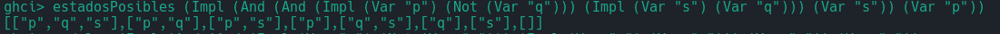
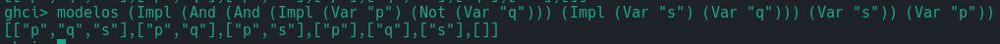

# Lógica Computacional 2026-2

## Práctica 2

Para trabajar sobre esta base, tienen que hacer un fork de este repositorio y trabajar sobre él.

Únicamente modifiquen el archivo Practica02.hs que se encuentra en el directorio src. Si quieren modificar las pruebas o agregar más, pueden preguntarme con confianza y les explico como modificarlas.

Deben tener instalado el compilador de Haskell para poder probar su práctica. Para ello deben colocarse en el directorio src y ejecutar el comando `ghci Practica02.hs`.

Si quieren probar su práctica haciendo uso de las pruebas unitarias que les estoy pasando, tienen que ejecutar los siguientes comandos desde el directorio donde se encuentra este ReadMe:
```
cabal build
cabal test
```

El primero es para compilar y el segundo es para ejecutar las pruebas unitarias.

Si no les llegan a funcionar, es posible que el problema es que tengan una versión diferente de cabal y de ghc. Si ese es el caso, pueden ejecutar el comando `ghc-pkg list base` para reemplazar la versión base que viene en el archivo .cabal en las líneas 70 y 102.

## Integrantes

En esta sección deben eliminar esta línea de texto, borrar la leyenda "Integrante n" y escribir su nombre empezando por apellidos y su número de cuenta.

+ Integrante 1
    - No. de Cuenta: 321009078
    - Nombre: Bedoya Tellez Ariadna Valeria
+ Integrante 2
    - No. de Cuenta: 321213554
    - Nombre: Hernandez Guerrero Francisco Javier
+ Integrante 3
    - No. de Cuenta: 424107994
    - Nombre: Rivera Perez Fernando Javier

## Comentarios

En las pruebas, en los test estadosPosibles y modelos falla en la formula Cg, aunque devuelve los mismos elementos, en la prueba se considera el orden.



El resultado esperado: __[["q","s","p"],["q","s"],["q","p"],["q"],["s","p"],["s"],["p"],[]]__



El resultado esperado: __[["q","s","p"],["q","p"],["q"],["s","p"],["s"],["p"],[]]__